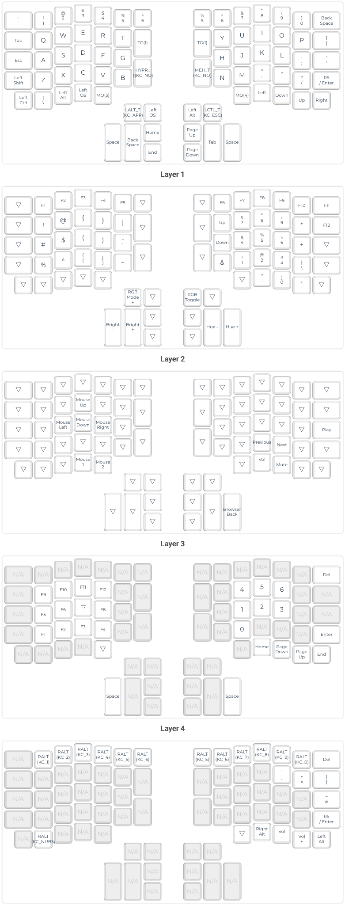

# qmk-preonic-danish
My attempt(s) at a Danish layout on the Preonic Rev3

## How to use (the latest build)
1. Be sure you own a Preonic Rev3.
1. Download and install QMK Toolbox from [here](https://github.com/qmk/qmk_toolbox/releases/latest) and test that it works, by following guides from [here](https://qmk.fm/toolbox/).
1. Download the [latest build](https://github.com/drasbeck/qmk-preonic-danish/blob/master/preonic_rev3_danskish.bin) of the keymap.
1. Point QMK toolbox to `/local/path/preonic_rev3_danskish.bin`
1. Go into DFU mode: while connected, push the tiny button on the bottom of your keeb
1. Flash!

## Layout

### Todo
* Upload illustration of keymap (Print Keymap button on QMK configurator was not working at the time of trying (2019-12-11 14:20)).
* Describe files.
* PR keymap into official repo.
* Improvements, improvements, improvements.
